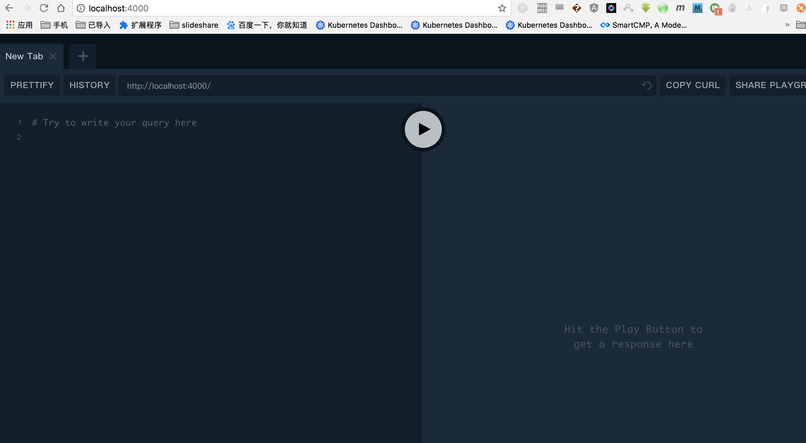
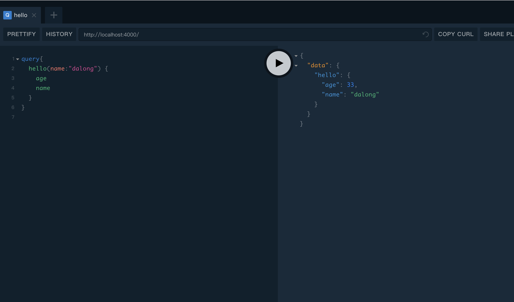

# graphql basic demo with graphql-yoga

## How to Run

```code
yarn
```

## Access && Test

* start

```code
yarn start
```

* test

```code
open http://localhost:4000
```

## some images






## for docker useage

* build image

```code
docker-compose build
```

* docker-compose run

```code
docker-compose up -d
```

## with curl call

```code
curl -H "Content-Type:application/json" -X POST -d '{"query":"fragment user on User {\n  name\n}\n\n{\n  listOfStrings\n  hello(name: \"dalong\") {\n    ...user\n  }\n}\n"}' http://hostip:4000
```